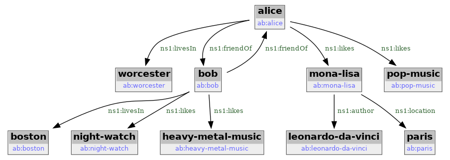

# SHACL editor

## Introduction

### RDF triples

[RDF (Resource Definition Framework)](https://en.wikipedia.org/wiki/Resource_Description_Framework) is standartized way to store facts in the form of RDF triples. E.g. using [RDF/turtle](https://en.wikipedia.org/wiki/Turtle_(syntax)) format it is possible to define such statements:

```
@prefix rdf: <http://www.w3.org/1999/02/22-rdf-syntax-ns#> .
@prefix rdfs: <http://www.w3.org/2000/01/rdf-schema#> .
@prefix ab: <ab:> .

ab:Human rdf:type rdfs:Class .
ab:alice rdf:type ab:Human .
ab:alice ab:name "Alice".
ab:bob rdf:type ab:Human .
ab:bob ab:name "Bob" .
```

In example above two facts are stored related to proverbal Alice-Bob pair:

 - there is a human named Alice with identity `ab:alice`
 - there is a human named Bob with identity `ab:bob`

RDF/turtle allows to use URI in shortened form using `@prefix` directive. The same example where all URIs are complete would look like this:

```
<ab:Human> <http://www.w3.org/1999/02/22-rdf-syntax-ns#type> <http://www.w3.org/2000/01/rdf-schema#Class> .
<ab:alice> <http://www.w3.org/1999/02/22-rdf-syntax-ns#type> <ab:Human> .
<ab:alice> <ab:name> "Alice" .
<ab:bob> <http://www.w3.org/1999/02/22-rdf-syntax-ns#type> <ab:Human> .
<ab:bob> <ab:name> "Bob" .
```

In this example URIs are strings between angle brackets - but brakets are not part of URI. E.g. first line `predicate` is URI `http://www.w3.org/1999/02/22-rdf-syntax-ns#type`. URI is very often look like URL. However it is very likely you will not be able to get anything from such URI if you try to point your internet browser to that location. URI are just strings with certain requirements, they are used to identify the `resource`.

In third line of the example you've seen that object could also be present as `literal`. In RDF/turle literals are in double-quotes to distibguish them from URIs. Doble-quotes are not part of the literal. The third statement `object` is string *Alice*.

If you want to shorten the statement you can use `prefix` defined on top of RDF/turtle file. Prefixes are used to construct full URI from shortened form. The shortened form was used in first example: you can just substitute prefix value with prefix URI as given at the top of the file. Shortened URI look different from full URI: then never enclosed to angle brakets. They are also different from literals: no double-quote encloser.

You may think about RDF triples as extention of an idea of key-value pairs. Key-value pair has two parts: kay and value. The type of key and value may vary. You may have keys as strings and values as numbers, string - anything you can type into the file editor. E.g. you may have such KV pairs shown as CSV file fragment:

```
Key,Value
alice_type,Human
alice_name,Alice
bob_type,Human
bob_name,Bob
```

RDF makes two changes to key-value pairs idea. First it adds third element so you now will have subject-predicate-object triples instead of key-value pairs. Then RDF restricts what could be `subject`, `predicate` and `object`. In most cases the parts of RDF triple will be either [URIs](https://en.wikipedia.org/wiki/Uniform_Resource_Identifier) or [xsd literals](https://www.w3.org/TR/rdf11-concepts/#xsd-datatypes), [more on xsd literals](https://www.w3.org/TR/xmlschema-2/#built-in-datatypes).

### Knowledge graphs

Set of [RDF (Resource Definition Framework)](https://en.wikipedia.org/wiki/Resource_Description_Framework) triples can be tought of as [knowledge graph](https://en.wikipedia.org/wiki/Knowledge_graph). [Extended Alice-Bob example](/addendum/#appendix_c_alice-bob_rdf_triples) RDF triples can be presented as graph below:

[][file ab-objs.png]
[file ab-objs.png]: ab-objs.png

### SPARQL queries


## Graph store explorer (gse)

### Installation

```
python3 -m venv ~/venv/gse
source ~/venv/gse/bin/activate
cd shacled/utils
```

### Usage

**gse** is command-line utility to facilitate the tasks which could be described as 'graph store exploration'.

Given .ttl file it is possible to upload the content into GDB using `gse insert` command. This operation allow to specify **gse path** to resulting graph in GDB.

```
> ./gse insert --gse-path /alice-bob/simple --ttl-file ../examples/alice-bob/simple/data.ttl
... tbc
> ./gse ls
         gse_path                                         graph_uri
/alice-bob/simple <gse:Graph##03027263-2242-454b-8d4d-7aaecb9990ae>
```

