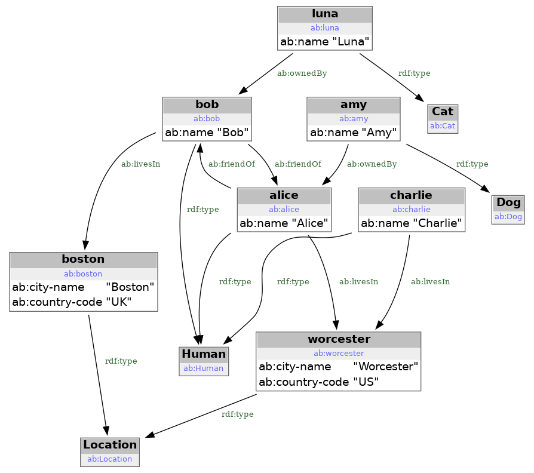
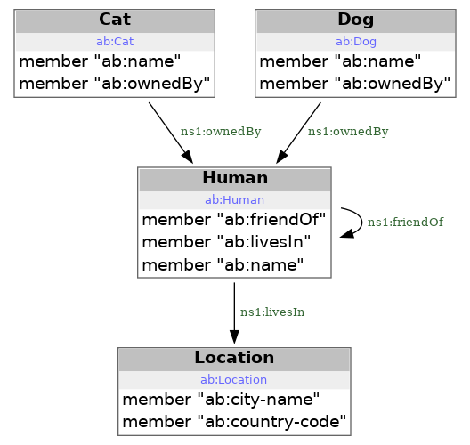

# Knowlege Graph for Practical Software Engeneering

## Preface

Knowledge Graph and related technologies were introduced by practitioners in the area of [knowledge representation](https://en.wikipedia.org/wiki/Knowledge_representation_and_reasoning). Historically KG technologies were used by data analysts and designers with purpose to build various ontologies and taxonomies to cover very wide areas of business and science. [Wikidata](https://www.wikidata.org/wiki/Wikidata:Main_Page) could be considered as famous example of such efforts. This project provides [SPARQL interface](https://www.wikidata.org/wiki/Wikidata:Request_a_query#Help_with_a_query) to allow queries using wikipedia data.

This document purpose is to provide practical alternative to the mainstream KG introductions. After minimalistic introduction we are going to concentrate on few examples of purely technical utilization of **available** KG tech tools. In most cases it will be possible to easily reproduce this document scripts and queries using only python's [rdflib](https://pypi.org/project/rdflib/) and [graphviz](https://pypi.org/project/graphviz/) packages.

## RDF and RDF/turtle

[RDF (Resource Definition Framework)](https://en.wikipedia.org/wiki/Resource_Description_Framework) is standartized way to store facts in the form of RDF triples. The example of such triples stored using [RDF/turtle](https://en.wikipedia.org/wiki/Turtle_(syntax)) format is given below. It is the data about ubiquitous [Alice-Bob pair](https://en.wikipedia.org/wiki/Alice_and_Bob). Note that it is fragment of bigger Alice-Bob RDF triples file [ab.data.ttl](/kgm/sparql-example/ab.data.ttl).

```
@prefix rdf: <http://www.w3.org/1999/02/22-rdf-syntax-ns#> .
@prefix ab: <ab:> .

ab:alice rdf:type ab:Human .
ab:alice ab:name "Alice".
ab:bob rdf:type ab:Human .
ab:bob ab:name "Bob" .
...
```

In example above few facts are stored in the form of [RDF statements](https://www.w3.org/TR/rdf11-primer/#section-triple):

 - there is a human named Alice identified using [URI](https://en.wikipedia.org/wiki/Uniform_Resource_Identifier) `<ab:alice>`
 - there is a human named Bob identified using [URI](https://en.wikipedia.org/wiki/Uniform_Resource_Identifier) `<ab:bob>`

[URI](https://en.wikipedia.org/wiki/Uniform_Resource_Identifier) is Uniform Resource Identifier. You can quickly glance to to [few examples](https://datatracker.ietf.org/doc/html/rfc3986#section-1.1.2) - as you see [URI](https://en.wikipedia.org/wiki/Uniform_Resource_Identifier) is quite practical and familiar notation used a lot in various web services. E.g. URL is special kind of URI.

In example above `ab:alice` and `<ab:alice>` are used to identify the same person, Alice. `ab:alice` is an example of [compact URI or CURIE](https://en.wikipedia.org/wiki/CURIE). RDF/turtle allows to use compact URIs using `@prefix` directive. The same example without using CURIEs:

```
<ab:alice> <http://www.w3.org/1999/02/22-rdf-syntax-ns#type> <ab:Human> .
<ab:alice> <ab:name> "Alice" .
<ab:bob> <http://www.w3.org/1999/02/22-rdf-syntax-ns#type> <ab:Human> .
<ab:bob> <ab:name> "Bob" .
```

Note what happen with compact URI `rdf:type`: it was expanded to <http://www.w3.org/1999/02/22-rdf-syntax-ns#type> which is URI in RDF/turtle syntax.

RDF/turtle prescribe to enclose URIs inside of angle brackets to designate the string between brackets as URI. The angle brackets themselves are not part of URI. E.g. first line *predicate* is URI `http://www.w3.org/1999/02/22-rdf-syntax-ns#type`.

In the second line of the example you've seen that *object* could also be [RDF literal](https://www.w3.org/TR/turtle/#literals). In RDF/turle literals are in double-quotes to distibguish them from URIs. Double-quotes are not part of the literal. The third statement *object* is string *Alice*.

There are other ways to represent RDF triples: e.g. [RDF/XML](https://en.wikipedia.org/wiki/RDF/XML). However [RDF/turtle](https://en.wikipedia.org/wiki/Turtle_(syntax)) syntax plays special role. It used as important part of query language SPARQL. It is also main RDF representation in various W3C and similar formal documents.

So from this point mention of RDF would assume RDF/turtle unless stated otherwise. We will also assume that any literal is actually RDF Literal.

## RDF triple structure

Each RDF triple has *subject*, *predicate* and *object* parts. 

You may think about RDF triples as extention of an idea of key-value pairs. Key-value pair has two parts: kay and value. The type of key and value may vary. You may have keys as strings and values as numbers, string - anything you can type into the file editor. E.g. you may have such KV pairs shown as CSV file fragment:

```
key,value
alice_type,Human
alice_name,Alice
bob_type,Human
bob_name,Bob
```

RDF makes two changes to key-value pairs idea:

 - it adds third element to the statement line so you now will have subject-predicate-object triples instead of key-value pairs.
 - RDF restricts what could be `subject`, `predicate` and `object`. In most cases the parts of RDF triple will be either [URIs](https://en.wikipedia.org/wiki/Uniform_Resource_Identifier) or [xsd literals](https://www.w3.org/TR/rdf11-concepts/#xsd-datatypes), [more on xsd literals](https://www.w3.org/TR/xmlschema-2/#built-in-datatypes).

## Knowledge Graph

Set of RDF triples can be tought of as [Knowledge Graph](https://en.wikipedia.org/wiki/Knowledge_graph) like this one below:

[][file sparql-example/ab.data.ttl.png]
[file sparql-example/ab.data.ttl.png]: sparql-example/ab.data.ttl.png

As before precise content of the graph is avaible in [ab.data.ttl](/kgm/sparql-example/ab.data.ttl) file. In plain english the KG tells us about Alice and Bob:

 - they are friends.
 - Alice lives in the location `<ab:worcester>` which is idenitied and [Worcester somewhere in US](https://en.wikipedia.org/wiki/Worcester,_Massachusetts) based on provided country code.
 - Bob lives in `<ab:boston>`. Unlike intiution based on URI `<ab:boston>` Bob does not live in the capital of Commonwealth of Massachusetts. `<ab:boston>` is identified in triples file as being [Boston somewhere UK](https://en.wikipedia.org/wiki/Boston,_Lincolnshire).
 - Both Alice and Bob owns pets: dog Amy and cat Luna.
 - there is one more person on diagram: `<ab:charlie>`. Charlie is from the same place as Alice.

## SPARQL

SPARQL is the programming language to query and manipulate RDF knowledge graphs. The example of SPARQL query and result using Alice-Bob dataset is below:

```
prefix rdf: <http://www.w3.org/1999/02/22-rdf-syntax-ns#>
prefix ab: <ab:>

select ?owner_name ?pet_name ?pet_class
where {
   ?pet rdf:type ?pet_class .
   ?pet ab:name ?pet_name .
   ?pet ab:ownedBy ?owner .
   ?owner ab:name ?owner_name .
}
```

[][file sparql-example/ab-rq-result.png]
[file sparql-example/ab-rq-result.png]: sparql-example/ab-rq-result.png

[SPARQL playground](https://atomgraph.github.io/SPARQL-Playground/)

If you want to experiment with this simple query you can install python package rdflib and use python script below:
[rdflib-sparql.py](/kgm/sparql-example/rdflib-sparql.py)

=== "short"

    ```python    
    
    ```
    
=== "long"

    ```python
    
    ```

Expected result:
```
['Amy', 'Alice', 'ab:Dog']
['Luna', 'Bob', 'ab:Cat']
```

## SHACL

[SHACL](https://en.wikipedia.org/wiki/SHACL) is W3C standard. SHACL was designed as the mean to describe RDF knowledge graphs structure. It can be thought as graph database analog of 'database schema'.

SHACL specify constraint to graph dabase nodes.

 - [ab.shacl.ttl](/kgm/sparql-example/ab.shacl.ttl)
 - [SHACL playground](https://shacl.org/playground/)

[][file sparql-example/ab.shacl.ttl.png]
[file sparql-example/ab.shacl.ttl.png]: sparql-example/ab.shacl.ttl.png
