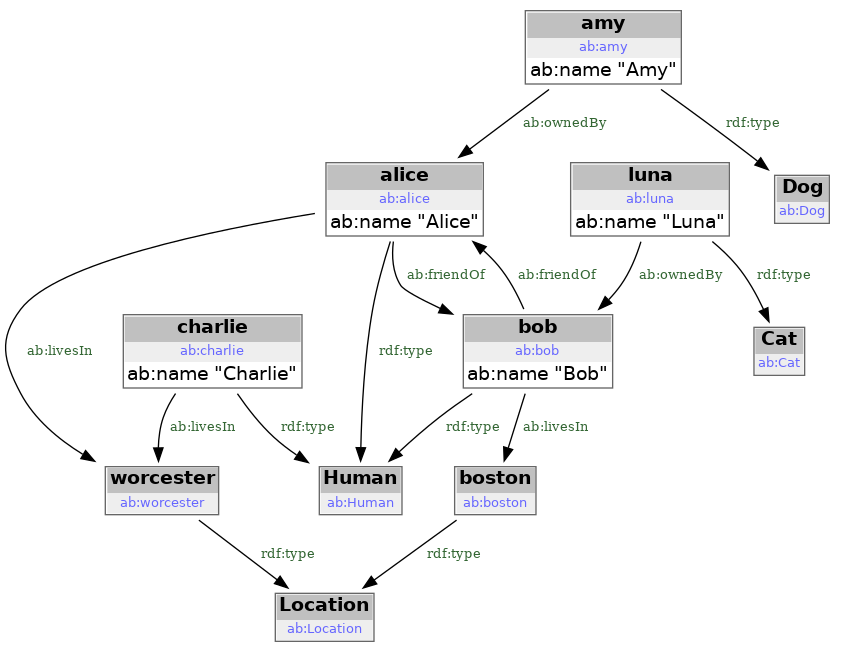
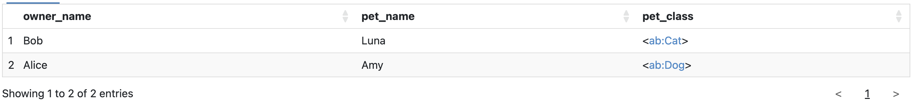

# KGM - Introduction
Hello

## RDF triples

[RDF (Resource Definition Framework)](https://en.wikipedia.org/wiki/Resource_Description_Framework) is standartized way to store facts in the form of RDF triples. The example of such triples stored using [RDF/turtle](https://en.wikipedia.org/wiki/Turtle_(syntax)) format is given below:

```
prefix rdf: <http://www.w3.org/1999/02/22-rdf-syntax-ns#> .
prefix ab: <ab:> .

ab:alice rdf:type ab:Human .
ab:alice ab:name "Alice".
ab:bob rdf:type ab:Human .
ab:bob ab:name "Bob" .
```

In example above two facts are stored related to proverbal Alice-Bob pair:

 - there is a human named Alice identified using URI `<ab:alice>`
 - there is a human named Bob identified using URI `<ab:bob>`

When using RDF/turtle notation, `ab:alice` and `<ab:alice>` are technically the same URI in two different forms: short and complete. RDF/turtle allows to use URI in shortened form using `@prefix` directive. The same example where all URIs are complete would look like this:

```
<ab:alice> <http://www.w3.org/1999/02/22-rdf-syntax-ns#type> <ab:Human> .
<ab:alice> <ab:name> "Alice" .
<ab:bob> <http://www.w3.org/1999/02/22-rdf-syntax-ns#type> <ab:Human> .
<ab:bob> <ab:name> "Bob" .
```

Also note RDF/turtle's complete URIs use angle brackets to designate the string between brackets as RDF URI. However the angle brackets themselves are not part of RDF URI. E.g. first line `predicate` is RDF URI `http://www.w3.org/1999/02/22-rdf-syntax-ns#type`. URIs are very often look like URLs - URLs are defined as subset of URIs. URIs are used to identify the `resources`.

In the second line of the example you've seen that object could also be present as `literal`. In RDF/turle literals are in double-quotes to distibguish them from URIs. Double-quotes are not part of the literal. The third statement `object` is string *Alice*.

You may think about RDF triples as extention of an idea of key-value pairs. Key-value pair has two parts: kay and value. The type of key and value may vary. You may have keys as strings and values as numbers, string - anything you can type into the file editor. E.g. you may have such KV pairs shown as CSV file fragment:

```
key,value
alice_type,Human
alice_name,Alice
bob_type,Human
bob_name,Bob
```

RDF makes two changes to key-value pairs idea:

 - it adds third element to the statement line so you now will have subject-predicate-object triples instead of key-value pairs.
 - RDF restricts what could be `subject`, `predicate` and `object`. In most cases the parts of RDF triple will be either [URIs](https://en.wikipedia.org/wiki/Uniform_Resource_Identifier) or [xsd literals](https://www.w3.org/TR/rdf11-concepts/#xsd-datatypes), [more on xsd literals](https://www.w3.org/TR/xmlschema-2/#built-in-datatypes).

## Knowledge graphs

Set of [RDF (Resource Definition Framework)](https://en.wikipedia.org/wiki/Resource_Description_Framework) triples can be tought of as [knowledge graph](https://en.wikipedia.org/wiki/Knowledge_graph). [Alice-Bob example RDF triples](/kgm/sparql-example/ab-small.data.ttl) can be presented as graph below:

[][file sparql-example/ab-small.png]
[file sparql-example/ab-small.png]: sparql-example/ab-small.png


## SPARQL

SPARQL is the programming language to query and manipulate RDF knowledge graphs. The example of SPARQL query and result using Alice-Bob dataset is below:

```
prefix rdf: <http://www.w3.org/1999/02/22-rdf-syntax-ns#>
prefix ab: <ab:>

select ?owner_name ?pet_name ?pet_class
where {
   ?pet rdf:type ?pet_class .
   ?pet ab:name ?pet_name .
   ?pet ab:ownedBy ?owner .
   ?owner ab:name ?owner_name .
}
```

[][file sparql-example/ab-rq-result.png]
[file sparql-example/ab-rq-result.png]: sparql-example/ab-rq-result.png

If you want to experiment with this simple query you can install python package rdflib and use python script below:

[rdflib-sparql.py](/kgm/sparql-example/rdflib-sparql.py)
```python

```

Expected result:
```
loaded 17 triples
query result:
['Alice', 'Amy', 'ab:Dog']
['Bob', 'Luna', 'ab:Cat']
```

## SHACL

[SHACL](https://en.wikipedia.org/wiki/SHACL) is W3C standard. SHACL was designed as the mean to describe RDF knowledge graphs structure. It can be thought as graph database analog of 'database schema'.

SHACL specify constraint to graph dabase nodes.

