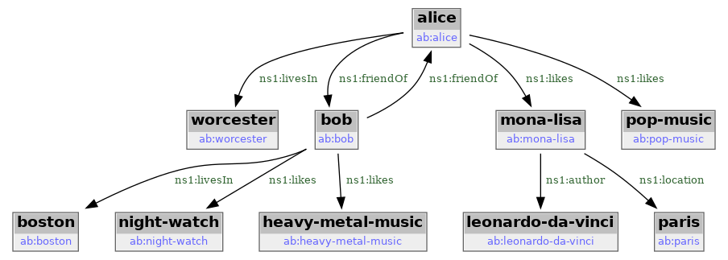

# KGM (Knowledge Graph Management)

## Introduction

### RDF triples

[RDF (Resource Definition Framework)](https://en.wikipedia.org/wiki/Resource_Description_Framework) is standartized way to store facts in the form of RDF triples. The example of such triples stored using [RDF/turtle](https://en.wikipedia.org/wiki/Turtle_(syntax)) format is given below:

```
@prefix rdf: <http://www.w3.org/1999/02/22-rdf-syntax-ns#> .
@prefix rdfs: <http://www.w3.org/2000/01/rdf-schema#> .
@prefix ab: <ab:> .

ab:Human rdf:type rdfs:Class .
ab:alice rdf:type ab:Human .
ab:alice ab:name "Alice".
ab:bob rdf:type ab:Human .
ab:bob ab:name "Bob" .
```

In example above two facts are stored related to proverbal Alice-Bob pair:

 - there is a human named Alice identified using URI `<ab:alice>`
 - there is a human named Bob identified using URI `<ab:bob>`

When using RDF/turtle notation, `ab:alice` and `<ab:alice>` are technically the same URI in two different forms: short and complete. RDF/turtle allows to use URI in shortened form using `@prefix` directive. The same example where all URIs are complete would look like this:

```
<ab:Human> <http://www.w3.org/1999/02/22-rdf-syntax-ns#type> <http://www.w3.org/2000/01/rdf-schema#Class> .
<ab:alice> <http://www.w3.org/1999/02/22-rdf-syntax-ns#type> <ab:Human> .
<ab:alice> <ab:name> "Alice" .
<ab:bob> <http://www.w3.org/1999/02/22-rdf-syntax-ns#type> <ab:Human> .
<ab:bob> <ab:name> "Bob" .
```

Also note RDF/turtle's complete URIs use angle brackets to designate the string between brackets as RDF URI. However the angle brackets themselves are not part of RDF URI. E.g. first line `predicate` is RDF URI `http://www.w3.org/1999/02/22-rdf-syntax-ns#type`. URIs are very often look like URLs - URLs are defined as subset of URIs. URIs are used to identify the `resources`.

In third line of the example you've seen that object could also be present as `literal`. In RDF/turle literals are in double-quotes to distibguish them from URIs. Double-quotes are not part of the literal. The third statement `object` is string *Alice*.

You may think about RDF triples as extention of an idea of key-value pairs. Key-value pair has two parts: kay and value. The type of key and value may vary. You may have keys as strings and values as numbers, string - anything you can type into the file editor. E.g. you may have such KV pairs shown as CSV file fragment:

```
key,value
alice_type,Human
alice_name,Alice
bob_type,Human
bob_name,Bob
```

RDF makes two changes to key-value pairs idea:

 - it adds third element so you now will have subject-predicate-object triples instead of key-value pairs.
 - RDF restricts what could be `subject`, `predicate` and `object`. In most cases the parts of RDF triple will be either [URIs](https://en.wikipedia.org/wiki/Uniform_Resource_Identifier) or [xsd literals](https://www.w3.org/TR/rdf11-concepts/#xsd-datatypes), [more on xsd literals](https://www.w3.org/TR/xmlschema-2/#built-in-datatypes).

### Knowledge graphs

Set of [RDF (Resource Definition Framework)](https://en.wikipedia.org/wiki/Resource_Description_Framework) triples can be tought of as [knowledge graph](https://en.wikipedia.org/wiki/Knowledge_graph). [Extended Alice-Bob example](/addendum/#appendix_c_alice-bob_rdf_triples) RDF triples can be presented as graph below:

[][file ab-objs.png]
[file ab-objs.png]: ab-objs.png

### SPARQL

SPARQL is the programming language to query and manipulate RDF knowledge graphs.

```
prefix kgm: <kgm:>
prefix ab: <ab:>

select ?owner_name ?pet_name ?pet_class
where {
  ?g kgm:path "/alice-bob"
  graph ?g {
   ?pet ab:name ?pet_name .
   ?pet rdf:type ?pet_class .
   ?pet ab:ownedBy ?owner .
   ?owner ab:name ?owner_name .
  }
}
```

### SHACL

SHACL is W3C standard adopted with purpose to provide the way to describe RDF knowledge graphs structure. It can be thought as graph database analog of 'database schema'.

## Examples

### Alice-Bob

data files location:

 - [KGM/examples/alice-bob/ab.ttl](https://github.com/GeiselSoftware/KGM/blob/main/examples/alice-bob/ab.ttl) -- data RDF triples
 - [KGM/examples/alice-bob/ab.shacl.ttl](https://github.com/GeiselSoftware/KGM/blob/main/examples/alice-bob/ab.shacl.ttl) -- SHACL structure

Alice-Bob queries:

```
prefix rdf: <http://www.w3.org/1999/02/22-rdf-syntax-ns#>
prefix kgm: <kgm:>
prefix ab: <ab:>

select ?owner_name ?pet_name ?pet_class
where {
  ?g kgm:path "/alice-bob"
  graph ?g {
      ?pet rdf:type ?pet_class;
           ab:name ?pet_name;
           ab:ownedBy ?owner;
      .
      ?owner ab:name ?owner_name .
  }
}
```

### northwind


## kgm command-line

### Installation

```
python3 -m venv ~/venv/kgm
source ~/venv/kgm/bin/activate
```

### Usage

**kgm** is command-line utility to facilitate the tasks which could be described as 'graph store exploration'.

Given .ttl file it is possible to upload the content into GDB using `kgm insert` command. This operation allow to specify **kgm path** to resulting graph in GDB.

```
> ./kgm insert --kgm-path /alice-bob/simple --ttl-file ../examples/alice-bob/simple/data.ttl
... tbc
> ./kgm ls
         kgm_path                                         graph_uri
/alice-bob/simple <kgm:Graph##03027263-2242-454b-8d4d-7aaecb9990ae>
```

